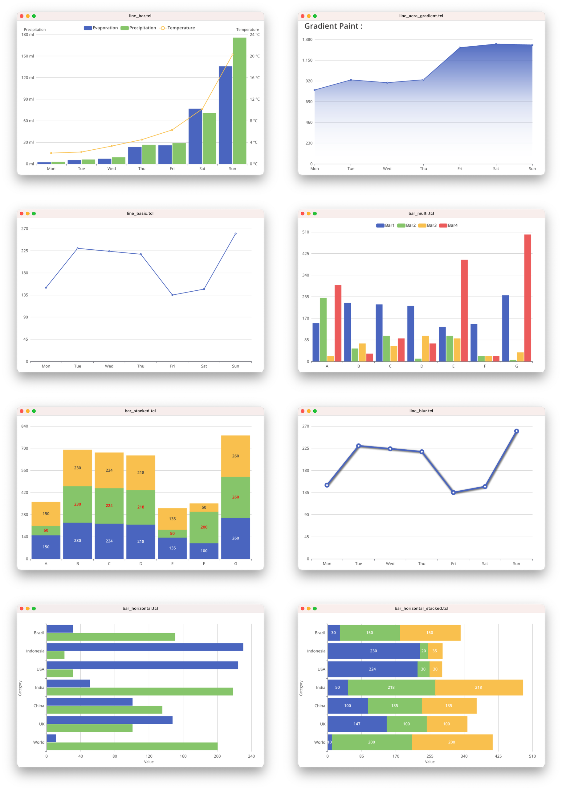

graphy - 2D charts library
================

> [!WARNING]  
> This project is in beta state, **anything** may change.

Dependencies :
-------------------------

- [pix](https://github.com/nico-robert/pix) package

Compatibility :
-------------------------
- **Tcl/Tk 8.6**

Example :
-------------------------
```tcl
package require graphy

# Create a new chart
set chart [graphy::Charts new]

# Set X-axis and Y-axis options.
$chart XAxis -data {Mon Tue Wed Thu Fri Sat Sun}
$chart YAxis

# Add line series data.
$chart Add "lineSeries" -data {150 230 224 218 135 147 260}

set w [$chart Render]

pack $w -expand true -fill both
```


See **[examples folder](/examples)** for more demos.

#### Series :
- [x] line (partially)
- [x] bar (partially)
- [ ] pie
- [ ] Radar
- [ ] Scatter
- [ ] Candlestick

Acknowledgments :
-------------------------
- [charts-rs](https://github.com/vicanso/charts-rs) (License MPL 2.0)

License :
-------------------------
[MPL 2.0](LICENSE) license.

Release :
-------------------------
*  **05-oct-2024** : 0.1b1
    - Initial release.
*  **11-oct-2024** : 0.1b2
    - Add vertical `stacked` bar series.
    - Add examples vertical `stacked` bar.
*  **13-oct-2024** : 0.1b3
    - Updating the `MIT` license to `MPL 2.0`, to match the derived code.
    - Cosmetic changes.
